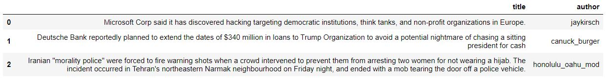
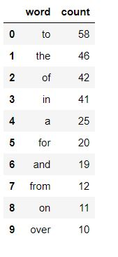
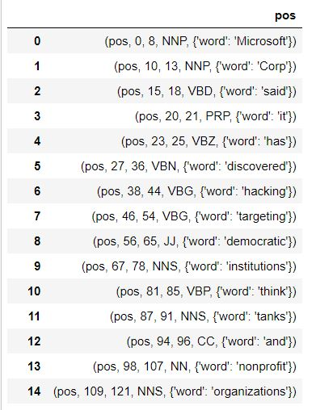
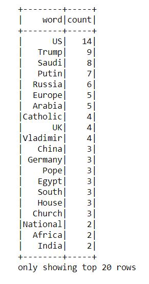

# Reddit-Trending-Topics-using-Spark-and-NLP

In this project, we read data from reddit server and try to interpret it using Spark and NLP. 

## Project Requirements
1. pyspark-sql

> pip install spark

2. spark-nlp

> pip install spark-nlp==1.7.3

3. pandas

## Execution Steps
1. Create the Spark context and read the data from reddit using json file format.
2. Extract required fields from the data.

3. From the data, we split each words and count its corresponding frequency. 
4. However, with this naive splitting we end up with stop-words with maximum frequency.

5. Hence, we tag each words using POS-tagger, which is a part of spark-nlp package.

6. Later, we extract words which are either common noun or proper noun.
7. We form a final map of extracted nouns and corresponding frequencies. 

These nouns represent top trending topics on Internet!!! 

## Future Scope
This project can be extended in many different ways. Following are the ways (but not limited to): 
1. We can create a web-UI by communicating with the python code in the backend. The UI would contain buttons to show trending topics along with the limit to show (Eg.- Top 10 / Top 20 etc.)
2. We can add other sources in addition to reddit to get more accurate information of top headline topics.